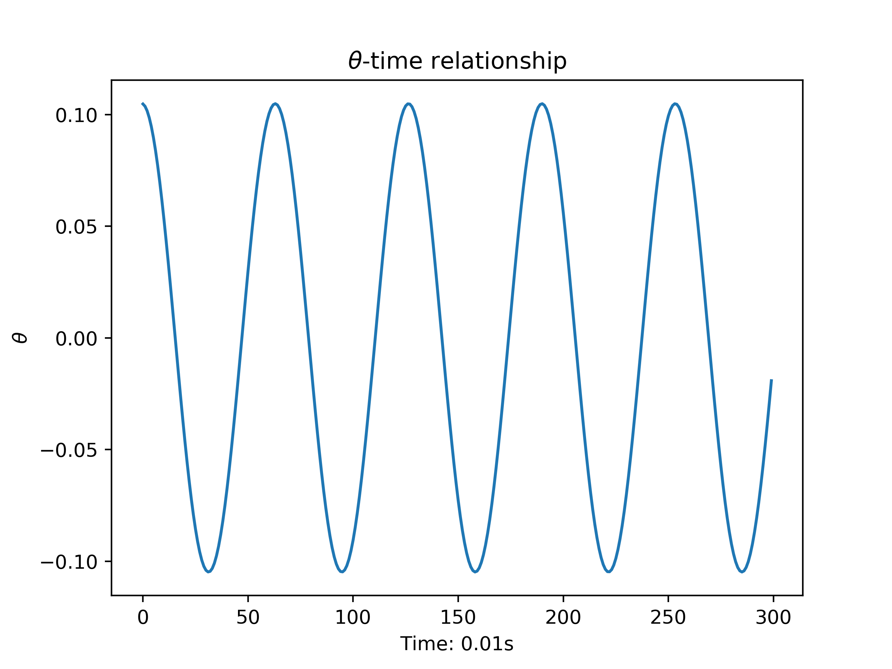
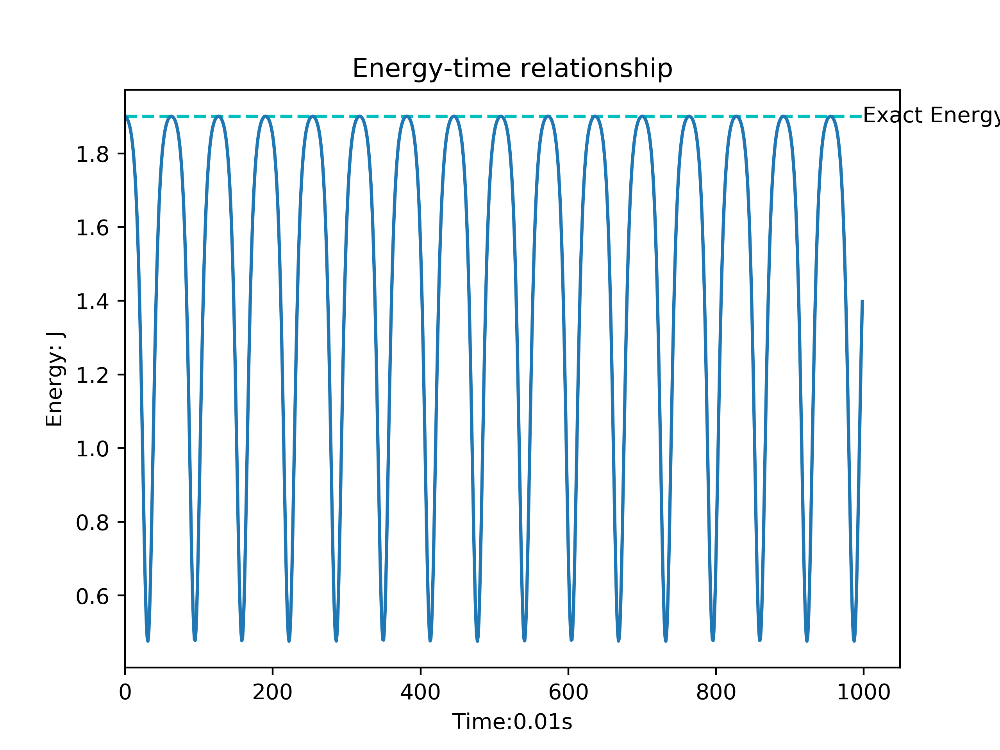
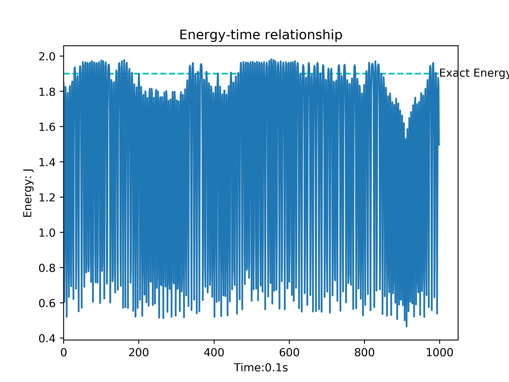

# PHYS ​5120: Homework 1

Author: MIAO Wangqian, Student ID: 20617902

## 1. The Linear and nonlinear pendulums

### 1.1 Solution

The equation of motion is in the format of:

$$ \frac{\mathrm{d^2}\theta}{\mathrm{d} t^2} + \frac{g}{\ell}\theta = 0$$

And the solution of the differential equation is:

$$\theta =  A \cos (\sqrt\frac{g}{\ell} t + \delta)$$

There are two parameters $A, \delta$ in the solution because we do not know the initial condition $\theta(t=0), \dot{\theta}(t=0)$.

The swing period is:

$$T = 2\pi \sqrt\frac{\ell}{g}$$

### 1.2 Solution

```bash
# use the following command to find help message
python pendulum.py -h
# the python command to run
python -O pendulum.py -s 0.01 -t 300 -a 6
```

The numerical solution is that: Figure1



### 1.3 Solutiom

After I solve the energy time relationship, I find that the energy is oscillating and it does not obey the energy conservation law. When I increase the timestep, the oscilation becomes more rapid. The exact energy is
shown in the plot.




