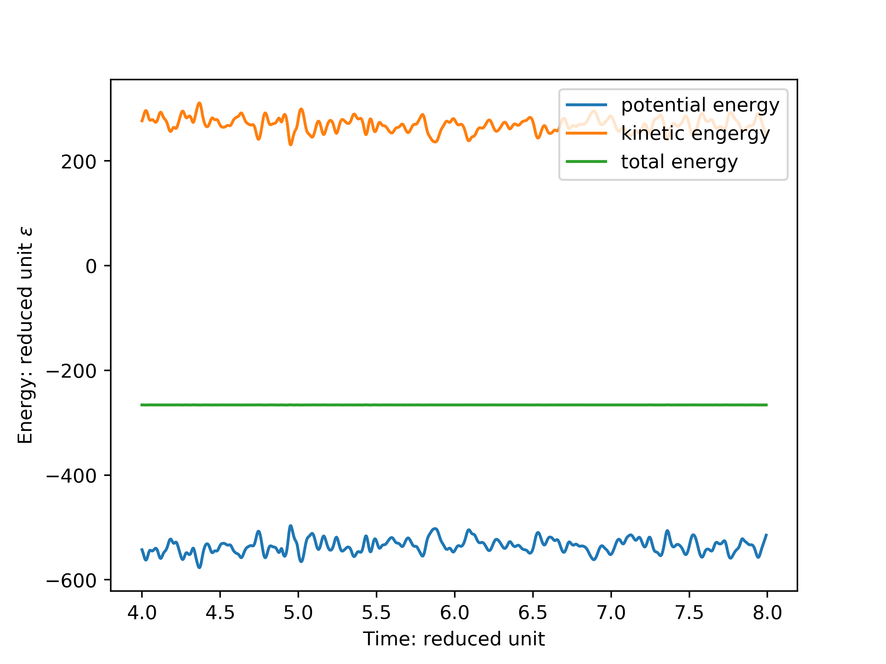
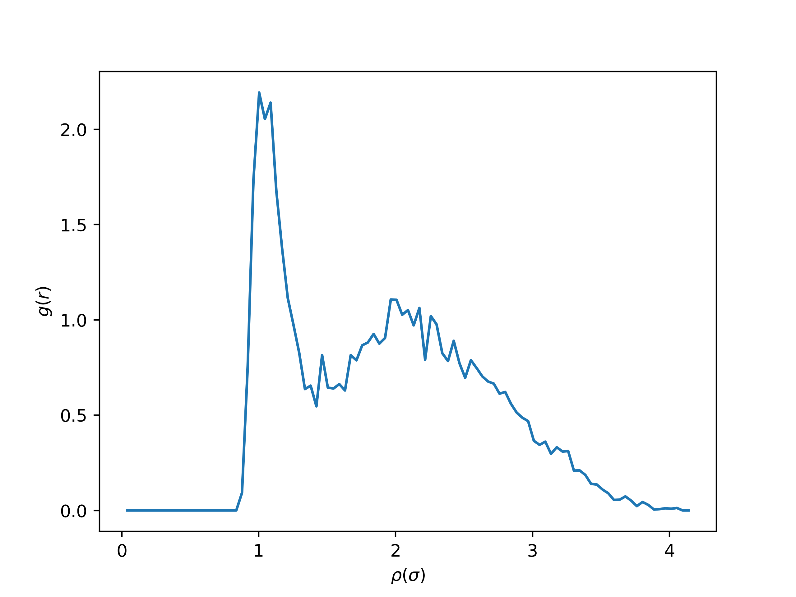

# Homework 2, Miao Wangqian

## Molecular dynamics simulations of Lennard-Jones Argon


```bash
# use the following command in bash
# you will get all figures and .gro file
# in the directory, the value of D shown
# on your screen
python md.py
```

## 1

The temperature in the reduced units is $\frac{203K}{119.8K}=1.70$

The number density in reduced units is $\frac{4}{1(\sigma)} =4$

## 2

The total energy is conserved, but kinetic energy and potential energy will fluctuate.



## 3


If the time step is very small, the change of position value will be small. so we do not need to write down every time step.

## 4

The radial distribution function is shown:



## 5

problem solved. remember the copy feature of python.