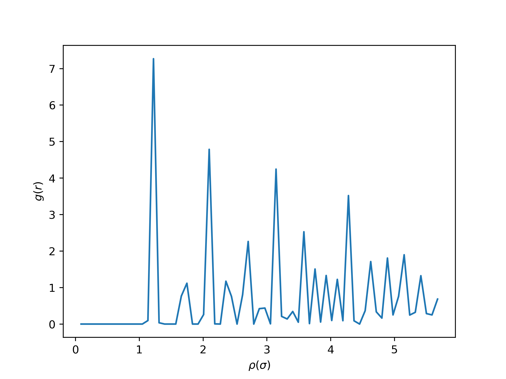

# Homework 3, Miao Wangqian

## Monte Carlo (MC) simulations of Lennard-Jones Argon

The radial distribution function is shown as following, which is consistent with the one from MD. The displacement should not be too large so that it will not change too much in the potential energy.

The trial displacement I use in my code is 0.01. I think MD or MC are all efficient in calculating RDF.

MD is good at calculating thermodynamic parameters, and MC is good at calculating Kinetic parameters

