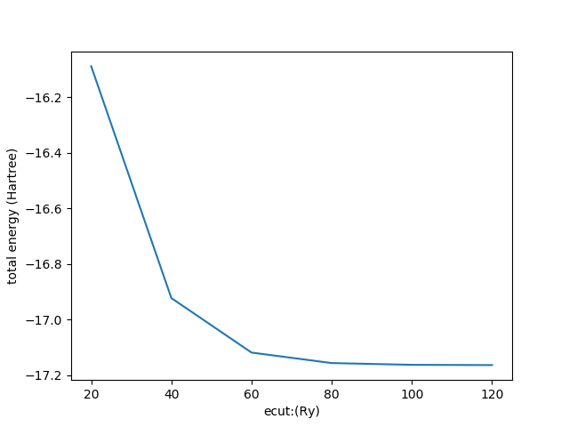

# DFT calculation of a water molecule

*Author: Wangqian Miao*

## 1

### (a)

1. `cell` - unit cell parameters. 
The cell variable contains the coordinates of the three lattice vectors defining the unit cell. The unit cell is defined using the set command with the following arguments.

2. `atom`. The atom command adds an atom to the current sample. The name argument can be any character string but must differ from all the other names of atoms in the current sample. The species argument must refer to an atomic species previously defined using the species command. The position of the atom is specified by its coordinates $x, y, z$ in atomic units (bohr, a.u.).

3. `ecut` - plane wave basis energy cutoff.
   The `ecut` variable determines the size of the plane wave basis used to define the electronic wave functions. It must given in Rydberg units. The wave function plane wave basis consists of all plane waves having a kinetic energy smaller than `ecut`. The charge density and the total potential are described using a larger basis set that includes all plane waves with a kinetic energy smaller than 4Ecut. The default value of `ecut` is zero, in which case the plane wave basis contains one basis function: the plane wave of wave vector $G=0$.

4. `PSDA`: the algorithm used to update wave functions by Preconditioned Steepest Descent with Anderson acceleration.

5. `scf_tol` – tolerance for convergence of SCF iterations.
The `scf_tol` variable determines the energy tolerance criterion for convergence of SCF iterations. The unit is (a.u.) (hartree). The default value is zero. The maximum number of SCF iterations is determined by the second argument of the run command: ` run niter nitscf nite `. If `scf_tol` is set to a non-zero value and if the energy changes by less than `scf_tol` in three successive SCF iterations, the remaining SCF iterations are skipped. If `scf_tol` is zero, the number of SCF iterations is `nitscf`.

6. `randomize_wf` - add a random perturbation to electronic wave functions.
The `randomize_wf` command adds random numbers to the Fourier coefficients of the electronic wave function. The amplitude argument can be used to change the intensity of the perturbation. The `randomize_wf` command is used at the beginning of an electronic structure calculation when the symmetry of the atomic coordinates is high. In such situations, the iterative algorithms used to compute the electronic ground state may converge to saddle points of the energy functional instead of true minima. Using `randomize_wf` introduces a slight symmetry breaking which is sufficient to avoid high-symmetry saddle points.

7. `ecutprec` - preconditioning energy cutoff.
The `ecutprec` variable defines the energy cutoff used in the preconditioner for electronic structure optimization. Corrections to the electronic wave functions are preconditioned in Fourier space using a diagonal preconditioning matrix K whose elements are defined.
The value of `ecutprec`must be given in Rydberg units. Preconditioning is only used if the `wf_dyn` variable is set to either PSD, PSDA or JD. If `ecutprec` = 0, an automatic preconditioner is used. The default value of` ecutprec` is zero (automatic preconditioning).

8. `run` - update electronic wave functions and/or atomic positions and/or unit cell.

LDA means local density approximation. It is one of the method to describe the exchange correlation **locally** in the many particle system.

### (b)

The total energy decreases when we increase `ecut`. That is true when we choose more plane wave functions as the basis of the many body system and it will be closer to the ground state energy.



## 2

By using `distance` and `angle` command in Qbox, we can easily get the distance between atoms and the H-O-H angle.

Before geometry optimization, the distance and angle is as following:

```bash
[qbox] <cmd>distance O H1</cmd>
 distance O-H1: 1.811 (a.u.) / 0.958 (Ang)
[qbox] <cmd>distance O H2</cmd>
 distance O-H2: 1.811 (a.u.) / 0.958 (Ang)
[qbox] <cmd>angle H1 O H2</cmd>
 angle H1-O-H2: 104.450 (deg)
```

After geometry optimization, the distance between the atoms and angle is as following, which is close to the experiments result shown above:

```bash
[qbox] <cmd>distance O H1</cmd>
 distance O-H1: 1.840 (a.u.) / 0.974 (Ang)
[qbox] <cmd>distance O H2</cmd>
 distance O-H2: 1.840 (a.u.) / 0.974 (Ang)
[qbox] <cmd>angle H1 O H2</cmd>
 angle H1-O-H2: 104.732 (deg)
```

According to the result, we find that the water molecule has $C_{2v}$ symmetry.

## 3

The result must converge well due to it is close to the real geometry of the water molecule. The source code of Qbox gives us the tool `dynmat` written in C. we can just use `dynmat` to calculate the eigenvalue and eigenstate of the dynamic matrix. 

```bash
### generate move.i
./fdmove.sh O H1 H2
### calculate vibration frequency
./dynmat force.mat 0.05 1 16 2 1
```

The matrix $D$ is not symmetric. Then we use the this method to get a symmetrized matrix $D_s$:

$$
D_s = \frac{1}{2}(D+D^{T})
$$

The three largest vibration frequencies are:

| VIBRATION FREQUENCY          | 1st                | 2nd               | 3rd       |
| ---------------------------- | ------------------ | ----------------- | --------- |
| Computational Result by Qbox | 3745 cm-1          | 3637 cm-1         | 1601 cm-1 |
| Experiment Result [1]        | 3490 cm-1          | 3277 cm-1         | 1654 cm-1 |
| Category                     | asymmetric stretch | symmetric stretch | bend      |

## 4

The first picture shows that HOMO has symmetry and the second picture shows that

LUMO has mirror symmetry. They are consistent with the reference [2].


## Reference

[1] [水的振动模式](https://www.researchgate.net/figure/The-three-vibrational-modes-of-the-water-molecule-and-their-fundamental-frequencies-in_fig3_5803530)

[2] [水的分子轨道](http://www1.lsbu.ac.uk/water/h2o_orbitals.html)