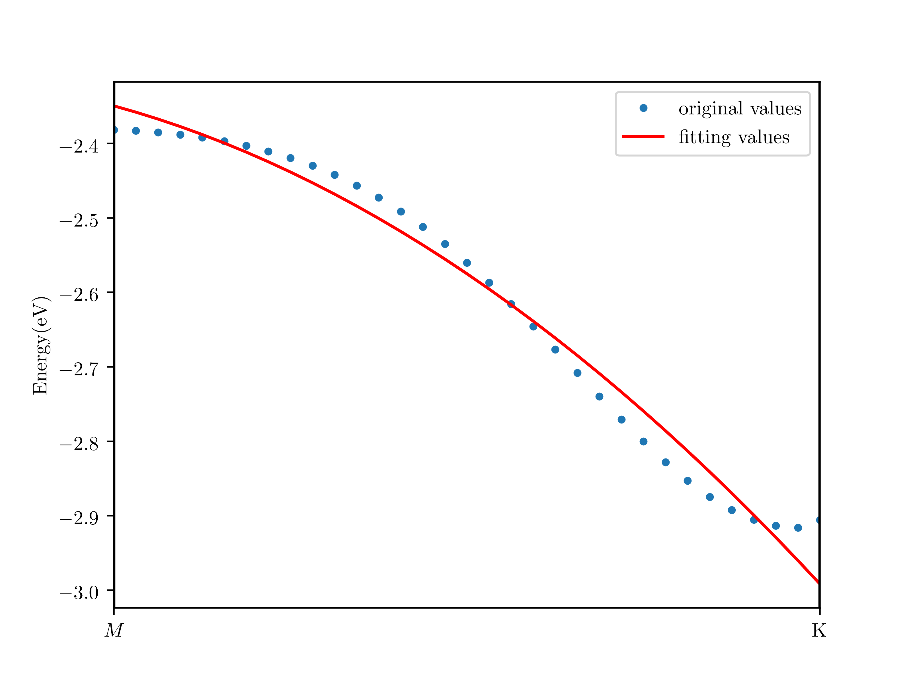

# 1. The Band Structure of MoS$_2$

*Miao Wangqian*

## 1.1. MP Sampling

When we use the MP sampling method to do the ground energy calculation, the result is as following.


## 1.2. Band Structure

```bash
# create band.i
python k_sample.py
# run qbox
qb.x < bandstructure.in > band.out
# plot
python band.py
```

The band structure in the path $\Gamma \rightarrow M \rightarrow K \rightarrow \Gamma$ is as following, which is consistent with reference[1].
The overview of total bands is as following:


Eight bands near fermi surface is as following (The green one is the top of valence band and the red one is the bottom of conduction band):


Two bands near fermi surface (The blue one is the valence band and the orange one is the conduction band):


The band gap at $K$ point is around  2.1 eV as shown in the picture above.

## 1.3. Effective Mass

The equation to calculate effective mass is as following:
$$
m_{\text{eff}} = \hbar^2 \left(\frac{\partial^2 E}{\partial k^2}\right)^{-1}
$$
The effective mass along the path $M \rightarrow K$ is $-4.51 \times 10^{-30}$kg. However, the effective mass
 at the $K$ is almost zero.



## 1.4. Reference

[1] Electronic structure of a single MoS2 monolayer, Eugene S. Kadantsevab, Pawel Hawrylakb https://doi.org/10.1016/j.ssc.2012.02.005